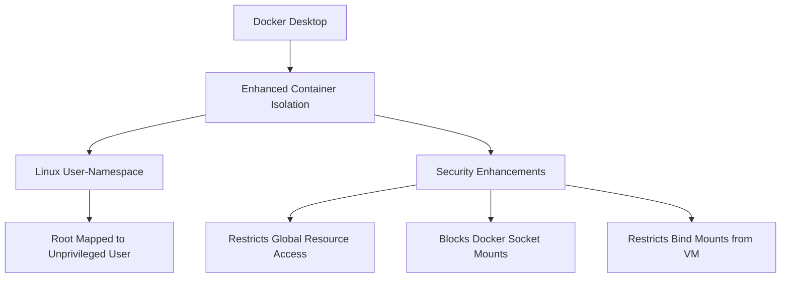

```mermaid
graph TD;
    A[Docker Desktop] --> B[Enhanced Container Isolation];
    B --> C[Linux User-Namespace];
    B --> D[Security Enhancements];
    C --> E[Root Mapped to Unprivileged User];
    D --> F[Restricts Global Resource Access];
    D --> G[Blocks Docker Socket Mounts];
    D --> H[Restricts Bind Mounts from VM];
```